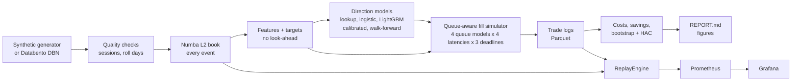

# Halftick

**Should you cross the spread or wait in line?** A queue-aware execution simulator that answers that, tick by tick, in large-tick futures markets.

[](https://github.com/Hijanhv/Halftick/actions/workflows/ci.yml)

> **Data note.** Every result here comes from a **synthetic** order-book generator (a queue-reactive model shaped like ZN and ES), not from real CME data. The results show that the method, simulator and statistics work end to end. They are **not** evidence of an edge in the real Treasury futures market. The Databento path for real data is built and unit-tested, and switching to it is a config change plus an API key.

<!-- results:start -->

## Results (synthetic data)


- On synthetic ZN, choosing between posting and crossing with the cost-to-go model cuts execution cost by **0.769 ticks per contract** versus always crossing the spread (95% day-block bootstrap CI 0.761 to 0.776) and by **0.008 ticks** versus always posting (CI 0.004 to 0.011), after fees and 10 ms latency, with a 15 s deadline and the proportional queue model (19,884 orders over 10 out-of-sample days). Against always posting, the edge is largest when the queue on our side is large (+0.015 ticks vs always posting, n = 9934) and smallest when the queue on our side is small (+0.000 ticks, n = 9950).
- On synthetic ES, choosing between posting and crossing with the cost-to-go model cuts execution cost by **0.690 ticks per contract** versus always crossing the spread (95% day-block bootstrap CI 0.688 to 0.693) and by **0.051 ticks** versus always posting (CI 0.026 to 0.076), after fees and 10 ms latency, with a 15 s deadline and the proportional queue model (3,980 orders over 2 out-of-sample days). Against always posting, the edge is largest when short-term volatility is high (+0.089 ticks vs always posting, n = 1322) and smallest when short-term volatility is moderate (+0.007 ticks, n = 1323).

- ZN next-move direction, out of sample: AUC 0.654 for the imbalance lookup, 0.657 for logistic regression, 0.663 for LightGBM.
- ES next-move direction, out of sample: AUC 0.699 for the imbalance lookup, 0.711 for logistic regression, 0.736 for LightGBM.

Full write-up with method, regime breakdowns, queue-model validation and limitations: [reports/REPORT.md](reports/REPORT.md).

<!-- results:end -->

## The question

You need to buy one 10-year Treasury future (ZN) in the next few seconds. You can:

* **cross the spread** with a market order: certain, but you pay half a tick against the mid;
* **post a limit order** at the bid: you might earn half a tick instead, but you join the back of a queue that is often hundreds of lots deep, you may not fill before your deadline, and you tend to fill exactly when the price is about to move through you.

Halftick reads the order book (queue imbalance, microprice, order flow), predicts the next price move with calibrated models, and simulates limit orders honestly, joining the back of the queue and moving up only as trades and cancellations clear the volume ahead. It then measures how many ticks per contract a model-driven choice saves against always crossing and against always posting, with confidence intervals.

## How it works



| Area | Module | What it does |
|---|---|---|
| Synthetic market | `data/synthetic.py` | Queue-reactive order book (Huang, Lehalle & Rosenbaum 2015) with informed flow, intraday activity, macro-release shocks, a contract roll, true cancellation positions, and injected data faults |
| Data | `data/` | Cost-checked Databento downloader with a budget ledger and cache; DST-correct sessions; release windows; roll detection from volume; data-quality reports |
| Order book | `book/l2book.py` | Numba price-level book shared by the batch pipeline and the event-driven engine |
| Features and targets | `features/`, `targets/` | Queue and depth imbalance, microprice, OFI, trade-flow imbalance, queue depletion, volatility; next-move direction and 1/5/30 s returns |
| Models | `models/` | Gould-Bonart lookup, logistic regression, LightGBM; isotonic calibration; day-based walk-forward; Newey-West tests |
| Simulator | `sim/` | Fills under pessimistic, proportional, optimistic and exact queue models; latency; deadlines; six strategies including a cost-to-go model and an oracle upper bound |
| Diagnostics | `diagnostics/` | Regime breakdowns, signal decay, stability, queue-model validation against the truth |
| Monitoring | `replay/`, `monitoring/` | Event-driven `ReplayEngine`, Prometheus metrics, alert rules, provisioned Grafana dashboard, real-time replay |

Plain-English explainers for every module, written for interview prep, are in [`docs/explainers/`](docs/explainers/README.md). The original spec and the agreed amendments are in [`PROJECT_SPEC.md`](PROJECT_SPEC.md).

## Run it

Needs Python 3.12 and [uv](https://docs.astral.sh/uv/). On macOS, LightGBM also needs OpenMP: `brew install libomp`.

```bash
uv sync
uv run halftick all          # synth -> build-features -> train -> simulate -> diagnose, ZN and ES, then report
```

Or step by step:

```bash
uv run halftick synth -i ZN                         # 22 synthetic days
uv run halftick build-features -i ZN --drop-events  # quality checks, book, features, targets
uv run halftick train -i ZN                         # walk-forward direction models
uv run halftick simulate -i ZN                      # execution simulation over the full grid
uv run halftick diagnose -i ZN                      # where it works and where it fails
uv run halftick report                              # reports/REPORT.md and this README's results block
```

Every tunable number is in `config.yaml`; override any key with `--set key=value`, for example `--set sim.decisions_per_day=500`. A full run of both instruments takes about 40 minutes on a laptop and needs about 2 GB of free disk at peak.

### Live dashboard

```bash
docker compose up --build
```

> **Status:** the compose file, Prometheus config, alert rules and Grafana provisioning are validated, and the replay engine, metrics endpoint and trade-log playback are tested live outside Docker. The full `docker compose up` stack has not yet been run end to end: the development machine did not have the ~3 GB of free disk the images need.

* Grafana: http://localhost:3000 (dashboard "Halftick replay", no login)
* Prometheus: http://localhost:9090 (alerts at `/alerts`)

The app replays a trading day at market speed, starting at 09:30 ET. If `./data` holds processed days it replays one with a simulated trade log, so the dashboard shows the research orders and their costs as they happen. Otherwise it generates a synthetic day in memory. The synthetic days contain short injected feed outages, so the "no market data" alert fires for real during the replay. Set `HALFTICK_SPEED=10` to replay ten times faster.

### Real data (Databento)

```bash
cp .env.example .env            # add DATABENTO_API_KEY
uv run halftick download -i ZN --start 2026-09-01 --end 2026-09-02 --schema mbp-10           # quote only
uv run halftick download -i ZN --start 2026-09-01 --end 2026-09-02 --schema mbp-10 --yes     # buy
uv run halftick --set data_source=databento build-features -i ZN
```

Every request is quoted first, cached, and refused if it would push total spend past `databento.budget_usd` ($100 by default).

## Tests

```bash
uv run pytest                                  # 68 tests
NUMBA_DISABLE_JIT=1 uv run pytest --cov=halftick  # coverage, about 97%
```

Property-based tests (Hypothesis) check the order book against a reference model and check that queue-ahead never increases in the simulator. Hand-built scenarios pin the fill time under each queue assumption. No-look-ahead tests cut the data at several points, and the streaming features must match the batch ones exactly. CI runs lint, mypy, and the tests with and without numba JIT on every push, and never needs an API key.

## Limitations

* **Synthetic data** is the big one: a model that wins here has learned this generator.
* Few days (19 ZN and 11 ES analysis days), so confidence intervals are wide by design.
* Queue position is assumed (four ways); with real data, MBO would be needed to know it.
* No real fills: our 1-lot order never affects the book, and latency is a fixed delay.

## References

Cont, Kukanov & Stoikov (2014) · Gould & Bonart (2016) · Huang, Lehalle & Rosenbaum (2015) · Stoikov (2018). Full citations in [`reports/REPORT.md`](reports/REPORT.md#references).
