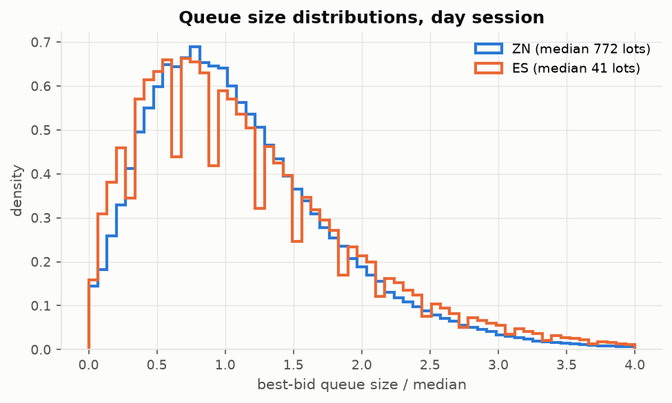
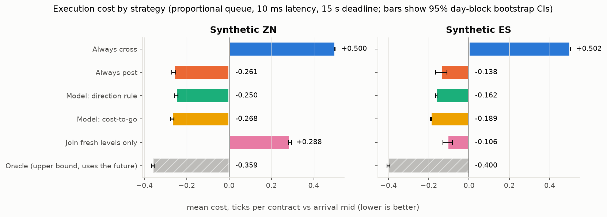
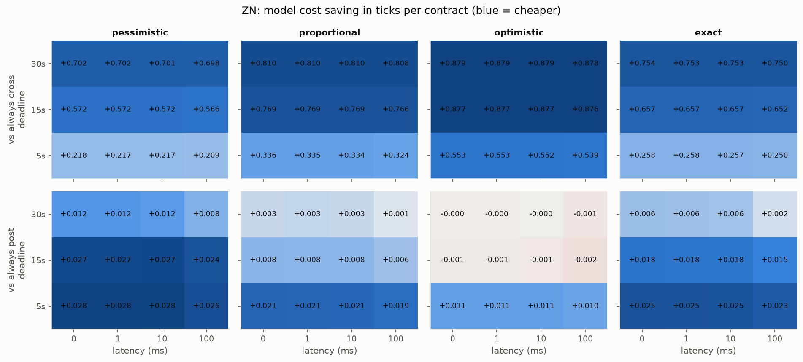
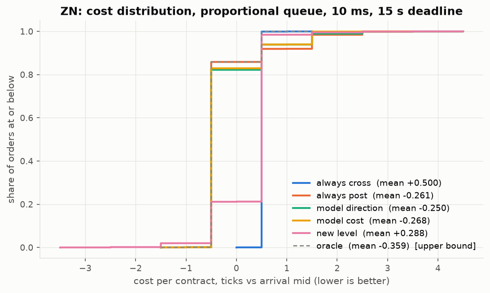
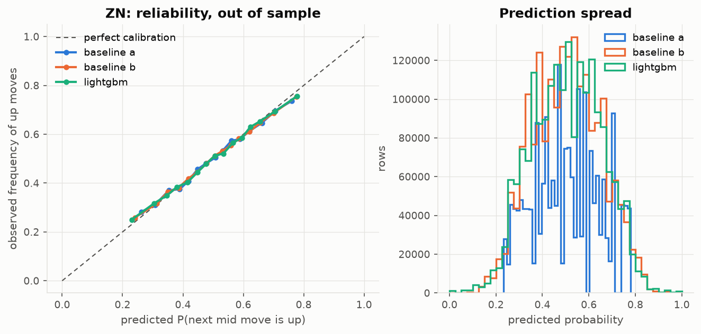
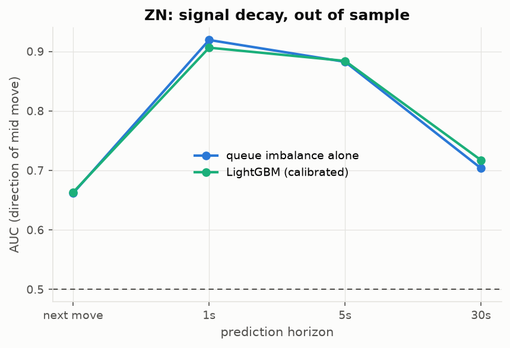
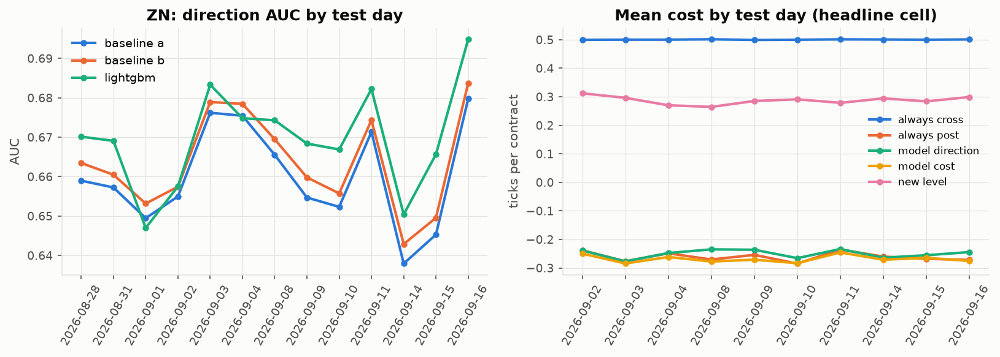
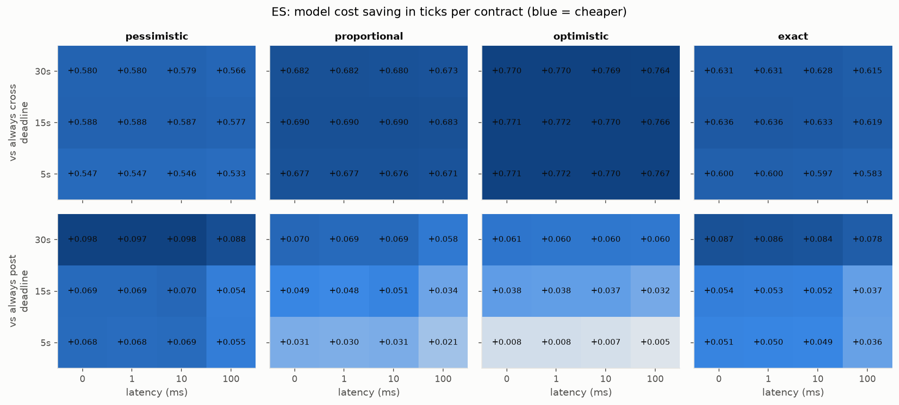

# Halftick: cross the spread or wait in line?

_Generated by `halftick report` on 2026-10-09 from the tables in `reports/tables/`. Every number below comes from code in this repository that ran on the data described in section 2._

> **Read this first.** All results come from a **synthetic** order-book generator, not from real CME data (no Databento key was available). They show that the method, the simulator and the statistics work end to end. They are **not** evidence that this edge exists in the real ZN or ES markets. Section 7 lists the limitations.

## 1. Question

A trader must buy (or sell) one contract within a few seconds. Crossing the spread with a market order is certain but pays half a tick against the mid. Posting a limit order at the near touch can earn half a tick instead, but it joins the back of a deep queue, may not fill before the deadline, and tends to fill exactly when the price is about to move through it. **When is waiting worth it?**

## 2. Data

* **Source: synthetic.** A queue-reactive limit order book (Huang, Lehalle & Rosenbaum, 2015): event rates depend on queue sizes, and the price moves only when a best queue is fully consumed. A hidden "informed flow" process tilts order arrival, activity follows an intraday U-shape, scheduled macro releases spike activity, a quarterly roll moves volume between contracts, and the true queue position of every cancellation is recorded (standing in for MBO data). Parameters were tuned so ZN looks like a deep large-tick book and ES like a faster book with smaller queues.
* **Days:** ZN: 22 generated, 19 used after excluding roll days detected from volume (2026-08-25, 2026-08-26, 2026-08-27). ES: 11 generated, 11 used.
* **Session:** 08:30-15:00 America/New_York (converted from UTC with zoneinfo, DST-safe). ±5-minute windows around scheduled releases are flagged and analysed separately.

| instrument | analysis days | events / day (session) | spread = 1 tick | median best queue (lots) | mid changes / min | trades / day |
|---|---|---|---|---|---|---|
| ES | 11 | 1,647,201 | 97.27% | 41 | 55.3 | 139,121 |
| ZN | 19 | 874,127 | 99.23% | 769 | 8.2 | 65,010 |

**Data quality** (the generator injects duplicates, sequence gaps and feed outages; the checks must catch them):

| instrument | days | duplicates removed | missing sequence numbers | crossed-book events | session gaps > 2 s | longest gap (s) |
|---|---|---|---|---|---|---|
| ES | 11 | 181 | 188 | 0 | 1 | 5.059 |
| ZN | 22 | 206 | 202 | 0 | 6 | 7.645 |

## 3. Method

* **Features** (every event, strictly backward-looking, tested for look-ahead): queue imbalance and depth imbalance over 3/5/10 levels (Gould & Bonart, 2016); microprice (Stoikov, 2018); order flow imbalance over 10/50/200 events and 100 ms/1 s/5 s (Cont, Kukanov & Stoikov, 2014); trade-flow imbalance; queue depletion rates; spread; time since the last mid change; short-term volatility.
* **Direction models** for the next mid-price change: (A) the imbalance-decile lookup table, (B) logistic regression on imbalance, microprice and OFI, and LightGBM on all features. All are calibrated with isotonic regression on a held-out day. Walk-forward by day: train on days 1..k, calibrate on k+1, test on k+2, never shuffling across time.
* **Fill simulator:** a limit order joins the back of the queue at the touch, the queue ahead shrinks with trades and (depending on the assumption) cancellations, and it fills when a trade at our price is larger than what is still ahead of us, when the market trades through our price, or when the other side reaches it. Every action takes effect after the latency. Unfilled orders cross at the deadline. Four cancellation assumptions: pessimistic, proportional, optimistic, and **exact** (the synthetic truth).
* **Strategies,** all on the same 2,000 random decisions per day (a paired comparison): always cross; always post; post and give up when the calibrated probability of an adverse move exceeds a threshold tuned on the calibration day; post and give up when a **cost-to-go model** predicts that waiting costs more than crossing now; join only freshly opened price levels; and an **oracle upper bound** that uses future information.
* **The cost-to-go model** is a LightGBM regression of (price paid if we keep waiting) minus (price paid if we cross now), trained on checkpoints every 250 ms along simulated orders from the training days. Crossing when the prediction is positive is a one-step improvement over always posting.
* **Cost** is measured in ticks against the mid at the decision moment, plus a $2.50 fee per side. Uncertainty is shown two ways: a bootstrap that resamples whole test days, and Newey-West (HAC) t-statistics on the time-ordered per-order savings.
* **Simulation walk-forward:** train on at least 8 days, tune on the next day, test on the following 3, and roll forward. Grid: 4 queue models × 4 latencies (0, 1, 10, 100 ms) × 3 deadlines (5, 15, 30 s).

## 4. Results

### 4.1 Headline

On synthetic ZN, choosing between posting and crossing with the cost-to-go model cuts execution cost by **0.769 ticks per contract** versus always crossing the spread (95% day-block bootstrap CI 0.761 to 0.776) and by **0.008 ticks** versus always posting (CI 0.004 to 0.011), after fees and 10 ms latency, with a 15 s deadline and the proportional queue model (19,884 orders over 10 out-of-sample days). Against always posting, the edge is largest when the queue on our side is large (+0.015 ticks vs always posting, n = 9934) and smallest when the queue on our side is small (+0.000 ticks, n = 9950).

On synthetic ES, choosing between posting and crossing with the cost-to-go model cuts execution cost by **0.690 ticks per contract** versus always crossing the spread (95% day-block bootstrap CI 0.688 to 0.693) and by **0.051 ticks** versus always posting (CI 0.026 to 0.076), after fees and 10 ms latency, with a 15 s deadline and the proportional queue model (3,980 orders over 2 out-of-sample days). Against always posting, the edge is largest when short-term volatility is high (+0.089 ticks vs always posting, n = 1322) and smallest when short-term volatility is moderate (+0.007 ticks, n = 1323).

Headline cell for ZN (proportional queue, 10 ms, 15 s deadline, out of sample, release windows excluded):

| strategy | mean cost (ticks) | median | 90th pct | mean cost incl. fee | passive fill rate | adverse move 5 s after passive fill (ticks) | saving vs always cross [95% CI] |
|---|---|---|---|---|---|---|---|
| Always cross | +0.500 | +0.50 | +0.50 | $10.32 |  |  |  |
| Always post | -0.261 | -0.50 | +0.50 | $-1.58 | 85.9% | 0.046 | +0.761 [0.751, 0.771] |
| Model: direction rule | -0.250 | -0.50 | +0.50 | $-1.40 | 82.2% | 0.052 | +0.750 [0.742, 0.759] |
| Model: cost-to-go | -0.268 | -0.50 | +0.50 | $-1.69 | 82.9% | 0.049 | +0.769 [0.761, 0.776] |
| Join fresh levels only | +0.288 | +0.50 | +0.50 | $6.99 | 28.3% | 0.063 | +0.213 [0.204, 0.221] |
| Oracle (upper bound, uses the future) | -0.359 | -0.50 | +0.50 | $-3.11 |  |  | +0.860 [0.854, 0.866] |

Fees change every strategy's cost by the same amount, because every strategy trades exactly one contract per order and CME pays no rebate for resting liquidity. The cost-to-go model's mean cost is $-3.19 at $1.00, $-1.69 at $2.50, $-0.19 at $4.00 per side, but its saving versus always crossing is $12.01 at every fee level. Fees are therefore left out of the sensitivity grid.

### 4.2 Across the sensitivity grid (ZN)

- Model: cost-to-go vs always cross: significantly cheaper in **48 of 48** grid cells, significantly more expensive in 0, indistinguishable in 0 (95% day-block bootstrap).
- Model: cost-to-go vs always post: significantly cheaper in **32 of 48** grid cells, significantly more expensive in 0, indistinguishable in 16 (95% day-block bootstrap).
- Model: direction rule vs always cross: significantly cheaper in **48 of 48** grid cells, significantly more expensive in 0, indistinguishable in 0 (95% day-block bootstrap).
- Model: direction rule vs always post: significantly cheaper in **16 of 48** grid cells, significantly more expensive in 20, indistinguishable in 12 (95% day-block bootstrap).

### 4.3 Direction models (ZN)

| model | sample | rows | log loss | Brier | AUC | accuracy |
|---|---|---|---|---|---|---|
| baseline a | out of sample | 1,932,453 | 0.6567 | 0.2322 | 0.6540 | 0.6118 |
| baseline b | out of sample | 1,932,453 | 0.6549 | 0.2313 | 0.6569 | 0.6153 |
| lightgbm | out of sample | 1,932,453 | 0.6531 | 0.2300 | 0.6632 | 0.6181 |
| baseline a | in sample (avg per fold) | 1,650,000 | 0.6579 | 0.2328 | 0.6557 | 0.6103 |
| baseline b | in sample (avg per fold) | 1,650,000 | 0.6559 | 0.2319 | 0.6594 | 0.6127 |
| lightgbm | in sample (avg per fold) | 1,650,000 | 0.6202 | 0.2157 | 0.7222 | 0.6548 |
| baseline a | release windows, OOS | 17,547 | 0.6350 | 0.2221 | 0.6971 | 0.6395 |
| baseline b | release windows, OOS | 17,547 | 0.6306 | 0.2202 | 0.6993 | 0.6470 |
| lightgbm | release windows, OOS | 17,547 | 0.6528 | 0.2254 | 0.6781 | 0.6446 |

- Out of sample, LightGBM's AUC is 0.663 against 0.654 for the imbalance lookup and 0.657 for logistic regression (log-loss improvement over the lookup: Newey-West t = -5.20). The gain over the one-feature lookup table is real but small: most of the signal is queue imbalance.
- LightGBM's in-sample AUC is 0.059 higher than out of sample, so it overfits noticeably; the baselines barely do (0.002 for the lookup).
- **Failure mode:** inside macro-release windows LightGBM is worse than the simple baselines (AUC 0.678 vs 0.697 and 0.699). A likely reason: release periods are rare in the training days, and the more flexible model generalises worse to them than the simple ones.

Newey-West tests of the per-row log-loss difference (negative means the first model is better):

| model | vs | mean log-loss difference | HAC s.e. | t |
|---|---|---|---|---|
| lightgbm | baseline a | -0.00365 | 0.00070 | -5.20 |
| lightgbm | baseline b | -0.00180 | 0.00067 | -2.69 |
| baseline b | baseline a | -0.00185 | 0.00014 | -13.10 |

Signal decay (out of sample, direction of the mid move over each horizon):

| horizon | rows where the mid moved | AUC queue imbalance | AUC LightGBM |
|---|---|---|---|
| next move | 100.0% | 0.6618 | 0.6632 |
| 1s | 3.9% | 0.9192 | 0.9063 |
| 5s | 12.7% | 0.8825 | 0.8840 |
| 30s | 45.7% | 0.7036 | 0.7172 |

How to read this: the clock-time rows only score moments where the mid actually moved within the horizon. Over 1 second those are mostly moments where one queue is about to empty, which is exactly when imbalance is most informative, so the short-horizon AUC is high on a small, selected subset. It is a selection effect, not look-ahead (features use only past data, and this is tested). The fair comparison across horizons is how the AUC falls as the horizon grows and more ordinary moments are included.

## 5. Where it works and where it fails (ZN)

Execution cost by regime (headline cell):

| split | bucket | orders | always cross | always post | cost-to-go model | saving vs cross | saving vs post |
|---|---|---|---|---|---|---|---|
| period | normal | 19,884 | +0.500 | -0.261 | -0.268 | +0.769 | +0.008 |
| period | release | 116 | +0.500 | -0.353 | -0.362 | +0.862 | +0.009 |
| queue | large | 9,934 | +0.500 | -0.113 | -0.128 | +0.629 | +0.015 |
| queue | small | 9,950 | +0.501 | -0.408 | -0.408 | +0.909 | +0.000 |
| spread state | 1 tick | 19,864 | +0.500 | -0.261 | -0.268 | +0.769 | +0.008 |
| tod | close | 4,434 | +0.501 | -0.266 | -0.268 | +0.769 | +0.002 |
| tod | midday | 10,794 | +0.500 | -0.246 | -0.258 | +0.759 | +0.012 |
| tod | open | 4,656 | +0.500 | -0.289 | -0.292 | +0.792 | +0.003 |
| vol | high | 6,207 | +0.501 | -0.265 | -0.272 | +0.773 | +0.007 |
| vol | low | 7,194 | +0.500 | -0.249 | -0.256 | +0.756 | +0.008 |
| vol | mid | 6,483 | +0.500 | -0.270 | -0.279 | +0.779 | +0.008 |

Direction-model AUC by regime:

| split | bucket | rows | AUC imbalance lookup | AUC LightGBM |
|---|---|---|---|---|
| period | normal | 1,932,453 | 0.6540 | 0.6632 |
| period | release | 17,547 | 0.6971 | 0.6781 |
| queue | large | 965,503 | 0.6683 | 0.6686 |
| queue | small | 966,950 | 0.6398 | 0.6576 |
| spread state | 1 tick | 1,917,594 | 0.6549 | 0.6637 |
| spread state | wider | 14,859 | 0.5317 | 0.5920 |
| tod | close | 474,244 | 0.6639 | 0.6790 |
| tod | midday | 945,046 | 0.6518 | 0.6590 |
| tod | open | 513,163 | 0.6487 | 0.6566 |
| vol | high | 569,484 | 0.6492 | 0.6553 |
| vol | low | 673,312 | 0.6618 | 0.6702 |
| vol | mid | 689,657 | 0.6503 | 0.6640 |

Inside the ±5-minute release windows (116 orders, 2 day(s)), the cost-to-go model's saving versus always posting is +0.009 ticks (CI -0.048 to 0.074). The sample is small, so treat this as a sanity check, not a finding.

### ES comparison

| strategy | mean cost (ticks) | median | 90th pct | mean cost incl. fee | passive fill rate | adverse move 5 s after passive fill (ticks) | saving vs always cross [95% CI] |
|---|---|---|---|---|---|---|---|
| Always cross | +0.502 | +0.50 | +0.50 | $8.77 |  |  |  |
| Always post | -0.138 | -0.50 | +1.50 | $0.78 | 89.8% | 0.132 | +0.639 [0.612, 0.666] |
| Model: direction rule | -0.162 | -0.50 | +0.50 | $0.47 | 70.3% | 0.240 | +0.664 [0.661, 0.666] |
| Model: cost-to-go | -0.189 | -0.50 | +0.50 | $0.14 | 77.1% | 0.174 | +0.690 [0.688, 0.693] |
| Join fresh levels only | -0.106 | +0.50 | +0.50 | $1.17 | 84.1% | 0.012 | +0.608 [0.585, 0.630] |
| Oracle (upper bound, uses the future) | -0.400 | -0.50 | +0.50 | $-2.50 |  |  | +0.902 [0.895, 0.908] |

- Model: cost-to-go vs always cross: significantly cheaper in **48 of 48** grid cells, significantly more expensive in 0, indistinguishable in 0 (95% day-block bootstrap).
- Model: cost-to-go vs always post: significantly cheaper in **44 of 48** grid cells, significantly more expensive in 0, indistinguishable in 4 (95% day-block bootstrap).
- Model: direction rule vs always cross: significantly cheaper in **48 of 48** grid cells, significantly more expensive in 0, indistinguishable in 0 (95% day-block bootstrap).
- Model: direction rule vs always post: significantly cheaper in **30 of 48** grid cells, significantly more expensive in 6, indistinguishable in 12 (95% day-block bootstrap).

| model | sample | rows | log loss | Brier | AUC | accuracy |
|---|---|---|---|---|---|---|
| baseline a | out of sample | 743,571 | 0.6305 | 0.2200 | 0.6987 | 0.6470 |
| baseline b | out of sample | 743,571 | 0.6215 | 0.2162 | 0.7113 | 0.6538 |
| lightgbm | out of sample | 743,571 | 0.6022 | 0.2077 | 0.7363 | 0.6721 |
| baseline a | in sample (avg per fold) | 1,050,000 | 0.6294 | 0.2195 | 0.7006 | 0.6490 |
| baseline b | in sample (avg per fold) | 1,050,000 | 0.6197 | 0.2153 | 0.7141 | 0.6559 |
| lightgbm | in sample (avg per fold) | 1,050,000 | 0.5783 | 0.1977 | 0.7642 | 0.6926 |
| baseline a | release windows, OOS | 6,429 | 0.6480 | 0.2283 | 0.6695 | 0.6113 |
| baseline b | release windows, OOS | 6,429 | 0.6275 | 0.2191 | 0.7013 | 0.6413 |
| lightgbm | release windows, OOS | 6,429 | 0.6757 | 0.2354 | 0.6846 | 0.6298 |

- Out of sample, LightGBM's AUC is 0.736 against 0.699 for the imbalance lookup and 0.711 for logistic regression (log-loss improvement over the lookup: Newey-West t = -24.00). The gain over the one-feature lookup table is real but small: most of the signal is queue imbalance.
- LightGBM's in-sample AUC is 0.028 higher than out of sample, so it overfits noticeably; the baselines barely do (0.002 for the lookup).
- **Failure mode:** inside macro-release windows LightGBM is worse than the simple baselines (AUC 0.685 vs 0.670 and 0.701). A likely reason: release periods are rare in the training days, and the more flexible model generalises worse to them than the simple ones.

## 6. How wrong are the queue assumptions?

With real mbp data the queue position is unknown and has to be assumed. The synthetic data records the true position of every cancellation, so each assumption can be scored against the truth on the same orders (always-post strategy, 10 ms, 15 s, ZN):

| queue assumption | fill rate | true fill rate | same fill outcome as truth | cost bias vs truth (ticks) | fill-time error (ms) |
|---|---|---|---|---|---|
| exact | 75.2% | 75.2% | 100.0% | +0.000 | 0 |
| optimistic | 94.4% | 75.2% | 80.8% | -0.239 | 2933 |
| pessimistic | 66.7% | 75.2% | 91.5% | +0.094 | 919 |
| proportional | 85.9% | 75.2% | 89.3% | -0.122 | 1281 |

## 7. Limitations

* **Synthetic data.** This is the most important limitation. The generator encodes assumptions about how real books behave (queue-reactive rates, an informed-flow process, cancellations biased toward the back of the queue). A model that does well here has learned this generator, not the real CME market.
* **Few days.** 19 ZN and 11 ES analysis days, with out-of-sample tests on fewer still. Day-block bootstrap intervals reflect that.
* **Queue position.** Real mbp-1/mbp-10 data does not reveal where cancellations sit in the queue. Section 6 shows how much the answer depends on that assumption.
* **No real fills.** Our own 1-lot order never affects the book, and other traders never react to it. Latency is a fixed delay, not a distribution.
* **Fees** are a flat assumption. They cancel out of the comparison anyway (section 4.1).
* **The oracle** uses future information and is shown only as a ceiling.

## 8. With more time or data

1. Run the same pipeline on real Databento data. The downloader, its budget guard and the mbp converter are written and unit-tested. Buy MBO for a few days first, to measure true queue positions and fit the cancellation assumption from data.
2. Add a re-pegging option and size larger than one lot, where market impact starts to matter.
3. Replace the one-step cost-to-go policy with a full dynamic-programming or reinforcement-learning policy, and compare.
4. Add a DatabentoLiveSource: the engine and the Prometheus/Grafana monitoring already run on the same interface.

## References

* Cont, R., Kukanov, A. & Stoikov, S. (2014). The price impact of order book events. *Journal of Financial Econometrics*, 12(1), 47-88.
* Gould, M. D. & Bonart, J. (2016). Queue imbalance as a one-tick-ahead price predictor in a limit order book. *Market Microstructure and Liquidity*, 2(2).
* Huang, W., Lehalle, C.-A. & Rosenbaum, M. (2015). Simulating and analyzing order book data: the queue-reactive model. *Journal of the American Statistical Association*, 110(509), 107-122.
* Stoikov, S. (2018). The micro-price: a high-frequency estimator of future prices. *Quantitative Finance*, 18(12), 1959-1966.
